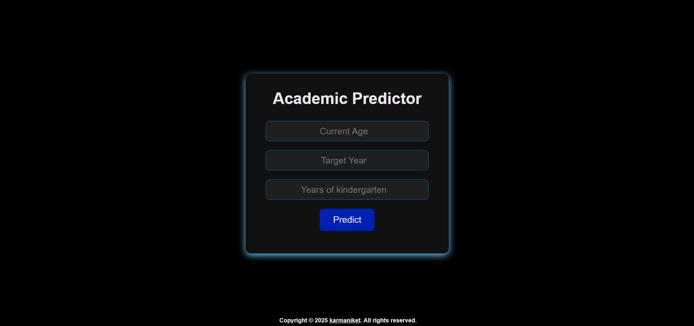

<h1 align="center">Academic Journey Predictor</h1>

A `JavaScript` based web app for students and graduates to predict their academic journey.

## 🌐 Live Demo

### Wondering what grade you were or will be in? Just pick a year and try [Academic Predictor](https://academicpredictor.pages.dev) app now

## 🚀 Features

- Predicts academic year using numeric input
- Easily determine in which grade you were or will be based on any given year
- Covers a wide range from Grade 1 to postgraduate degree
- A simple responsive user interface

## ❓ How to use

> [!TIP]
> Simply enter your current age
> Enter your desired/target year
> Enter your total years spent in kindergarten (default 5)
> Select your higher education, master's or bachelor's

## ⚡ Setup

### Clone the repository

    git clone https://github.com/karmaniket/Academic-Predictor.git
    cd Academic-Predictor

### Deploy on Cloudflare

- Push your code to GitHub repository
- Create a new page under `Worker & Pages` on Cloudflare
- Connect your repository and deploy
